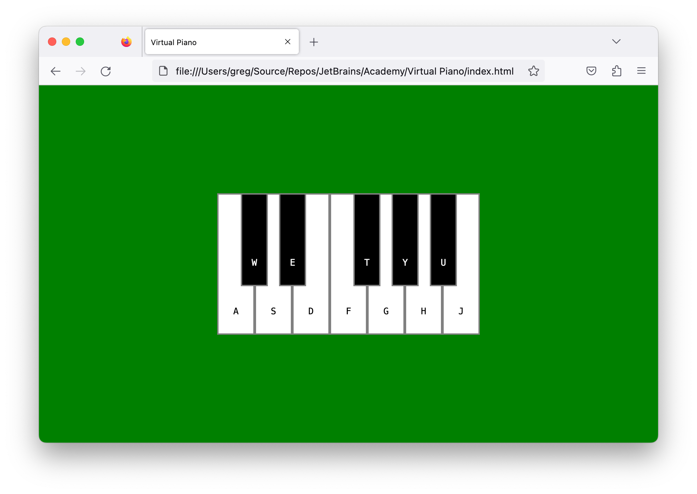

# JetBrains Academy Virtual Piano Project

An example of a passing solution to the final phase of the JetBrains Academy Frontend Core Virtual Piano project.

## Description

This project is a web page that displays piano like keys that are engaged by pressing keyboard keys. When a key is engaged, a sound corresponding to the key is played.

Try the app out at [CodePen](https://codepen.io/kimnetics/pen/MWPeYZj).

## Notes

The relative directory structure was kept the same as the one used in my JetBrains Academy solution.

The audio files were supplied by JetBrains Academy.
